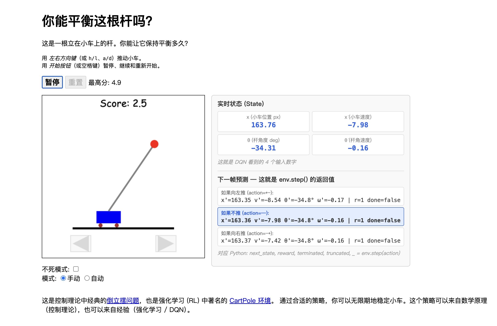
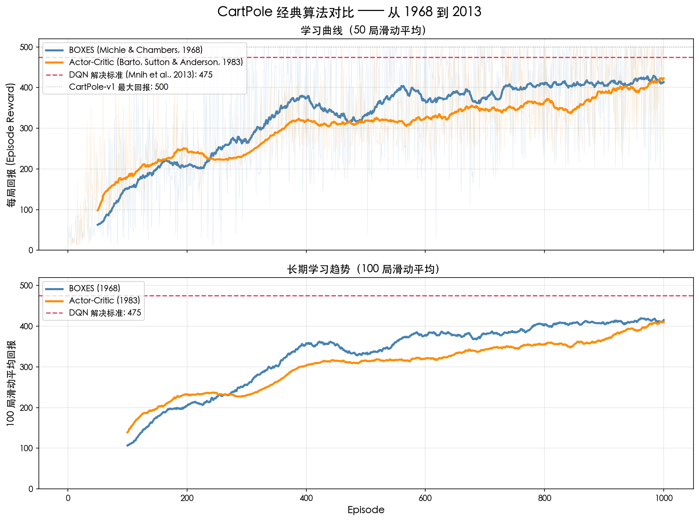
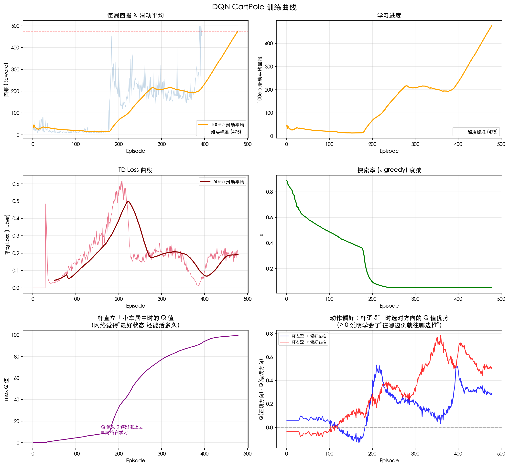
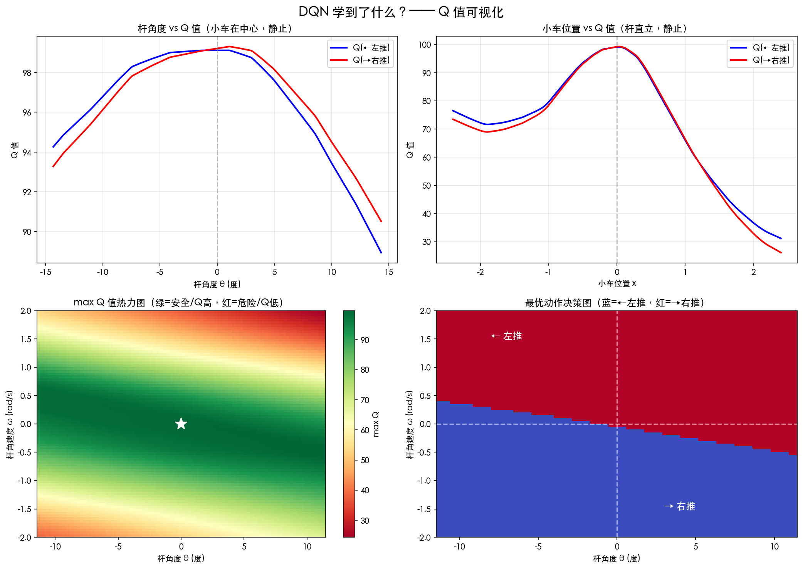
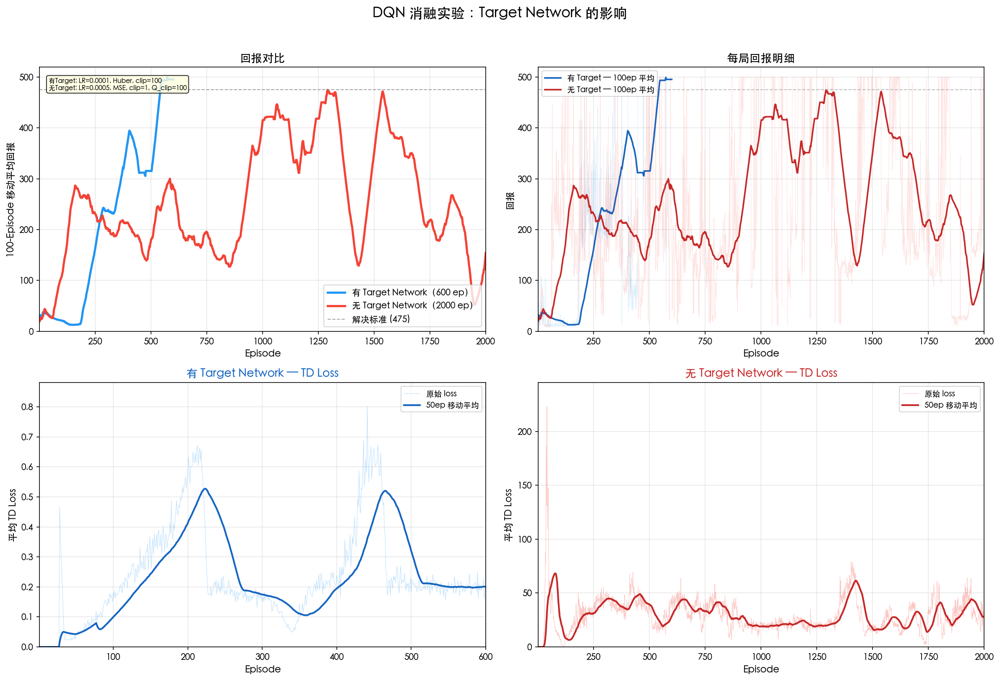

# CartPole 与深度 Q 网络：一根杆子如何串起半个世纪的 AI 史



---

## 一根杆子立在小车上

CartPole 的规则可以一句话说清：一根杆子铰接在一辆可以左右滑动的小车上，你的任务是通过推动小车让杆不倒。杆受重力影响，任何微小的偏移都会加速它的倾倒——这是一个**不稳定平衡**问题。

这个问题之所以成为强化学习领域半个世纪以来最常用的测试场景，不是因为它难——恰恰相反，它**足够简单**，简单到可以用来验证任何新算法的基本可行性。如果你的 AI 在平衡一根杆子上都学不会，那在围棋或自动驾驶上就更没戏了。

但"简单"不意味着"平凡"。整个系统只有 4 个数字描述状态（小车的位置和速度、杆的角度和角速度），2 个动作可选（向左推或向右推），却需要在短期目标（不让杆倒）和长期目标（不让车跑出平台）之间做出持续的权衡。这个微妙的平衡要求，使它成为检验 AI 决策能力的理想试金石。

---

## 最早的尝试：把世界装进格子里（1968）

1968 年，Donald Michie 和 R.A. Chambers 提出了 BOXES 算法。思路极其朴素：既然连续的状态空间太复杂，就把它**切成格子**。把小车位置分成 3 段（左/中/右），速度分成 3 段，杆角度分成 7 段，角速度分成 3 段——总共 189 个格子。每个格子记住"在这里选左推活得久还是右推活得久"，遇到同样的格子就选历史上更好的那个动作。

这本质上就是一张查找表。没有数学模型，没有优化算法，只有统计计数。但它**真的能学会平衡杆子**，在 1000 局训练后可以稳定到约 415 分（满分 500）。

BOXES 的局限也很明显：189 个格子的粒度太粗了。杆角度 0.05 弧度和 0.19 弧度被分到同一个格子里，但它们需要完全不同的应对策略。这就是离散化精度的天花板——格子切得越细越准，但数量会指数爆炸（4 个变量各切 100 段就是 1 亿个格子）。

---

## 两个"神经元"：现代强化学习的起点（1983）

1983 年，Andrew Barto、Richard Sutton 和 Charles Anderson 发表了一篇后来被引用 3400 多次的论文，用两个类神经元组件解决了 CartPole 问题。这两个组件各有分工：

**Critic（评论家）** 负责评估当前局面的好坏。它维护一个状态价值函数 V(s)，通过 TD 学习不断更新：每走一步，用"实际拿到的奖励 + 对下一步的预估"来修正对当前步的预估。如果实际比预估好（TD error > 0），说明低估了当前状态；如果实际比预估差（TD error < 0），说明高估了。

**Actor（演员）** 负责选择动作。它根据 Critic 给出的 TD error 来调整自己的偏好：如果刚才的动作导致 TD error 为正（"比预期好"），就加强这个动作；如果为负（"比预期差"），就削弱。

这个框架的核心洞察在于**将评估和决策分离**。BOXES 算法把这两件事混在一起（分数既是评估又决定选择），而 Actor-Critic 让评估（Critic）产生的信号（TD error）去指导决策（Actor）的学习——这就是现代 Actor-Critic 方法（A2C、A3C、PPO、SAC）的雏形。

值得一提的是，这两个"神经元"的更新方式和今天的反向传播**完全不同**。它们不计算梯度，而是直接用 TD error 乘以资格迹来修改查找表的值。每次只改当前访问的那个格子（以及资格迹覆盖的最近几个格子），其他 188 个格子纹丝不动。但背后的数学结构——Bellman 方程、TD 学习、策略梯度——和 30 年后的深度强化学习是一脉相承的。

在 CartPole 上，1983 年的 Actor-Critic 和 1968 年的 BOXES 效果差不多（都在 ~410 分左右）。这不是 Actor-Critic 不行，而是 CartPole 太简单了——189 个格子的查表就够用，体现不出更精细方法的优势。


*图：BOXES（1968）与 Actor-Critic（1983）学习曲线对比——在 CartPole 上两者最终表现几乎一致，体现了这个问题的"天花板效应"。*

---

## 一个等式改变一切：Bellman 方程

无论是 BOXES 的分数表、Actor-Critic 的 V(s)，还是后来 DQN 的 Q(s,a)，它们都在回答同一个问题：**从当前状态出发，未来能拿到多少总回报？** 这个问题有一个优美的递推解，由 Richard Bellman 在 1957 年提出：

> 最优总价值 = 这一步的即时奖励 + 下一步的最优总价值（打个折扣）

用公式写就是 `Q(s,a) = r + γ × max Q(s')`。这个方程看似简单，却蕴含了一个深刻的思想：**你不需要一次性规划到终点，只需要做好当前这一步，然后信任未来的自己也会做出最优选择**。

Bellman 在兰德公司为美国军方做多阶段决策优化时发现了这个递推结构。他后来回忆说，"Dynamic Programming"这个名字是故意取来糊弄讨厌"研究"一词的国防部长的——听起来很有活力，其实就是数学优化。

从 1957 年的 Bellman 方程到 2013 年的 DQN，核心递推关系从未改变。变化的是：谁来记住 Q 值（查表 → 神经网络），如何学习 Q 值（精确计算 → 采样估计 → 梯度下降），以及如何保证学习过程的稳定性（这是 DQN 真正解决的问题）。

---

## 深度 Q 网络：当神经网络遇上 Bellman（2013–2015）

2013 年，DeepMind 发表了 DQN 论文，用一个卷积神经网络直接从 Atari 游戏的像素画面学会了打游戏。这是深度学习和强化学习的首次成功结合，打破了此前近 20 年"Q-learning + 神经网络 = 发散"的魔咒。

### 从 Policy Gradient 到 Q-Learning：两种截然不同的学习哲学

如果你已经通过 Karpathy 的博客实现过 Policy Gradient 打 Pong，理解 DQN 的最好方式是和 PG 做对比。

Policy Gradient 的思路是**直接学策略**：网络输出"按上键的概率"，赢了就加强这局用过的动作，输了就削弱。信号来自环境的真实结果——真实但噪声大（赢的局里也有臭棋，全被加强了）。

DQN 的思路是**先学价值，再推策略**：网络输出"每个动作的预期未来总回报（Q 值）"，然后选 Q 值最大的那个。信号来自 Bellman 方程——用网络自己对下一步的估计来训练自己。方差小，但**在自己猜自己**（自举 bootstrapping），可能有系统性偏差。

| | Policy Gradient | DQN |
|--|:--:|:--:|
| 网络输出 | 动作概率 | Q 值（预期未来总回报） |
| 怎么选动作 | 按概率随机采样 | 选 Q 最大的（argmax） |
| 训练信号来源 | 一局的真实总回报 | Bellman 方程（自举估计） |
| 数据用法 | 用完即扔 | 存起来反复用 |
| 探索方式 | 天然（概率采样） | 需要 ε-greedy |
| 优势 | 简洁、信号真实 | 数据高效、方差低 |

### DQN 的三个关键工程创新

Bellman 方程本身在 1957 年就有了，Q-learning 算法在 1989 年就有了。DQN 的贡献不在算法理论，而在**让理论在实践中 work 起来**的三个工程创新：

**经验回放（Experience Replay）**：把每一步的经验 (状态, 动作, 奖励, 下一状态) 存进一个大缓冲区，训练时随机抽样。这打破了连续帧之间的时间相关性（让神经网络的 SGD 假设成立），同时让每条经验可以被多次学习（比 PG 的"用完即扔"高效得多）。缓冲区满了就 FIFO 覆盖最旧的——简单粗暴但够用。

**目标网络（Target Network）**：DQN 的 loss 公式 `(Q(s,a) - [r + γ max Q(s')])²` 里，左右两边都是同一个网络算出来的。每次更新左边的参数，右边的目标也跟着变——像追自己尾巴一样，可能导致 Q 值无限膨胀。解决方案是维护两个网络：一个正常训练（policy net），另一个冻住参数只用来算目标（target net），每隔一段时间才同步。这把一个不稳定的优化问题变成了一系列短暂的、目标固定的监督学习问题。

**ε-greedy 探索**：PG 天然有探索性（按概率采样），但 DQN 输出确定性的 Q 值做 argmax——完全没有探索。所以需要 ε-greedy：以概率 ε 随机选动作（探索），1-ε 选最好的（利用），ε 从高到低逐渐衰减。

### 训练过程中发生了什么

DQN 在 CartPole 上的训练过程可以分为三个阶段：

**瞎探索期（前 ~100 局）**：ε 很高，大部分时间在随机选动作，每局只能活 10-30 帧。但这些失败经验全进了缓冲区——网络开始学到"杆歪太多 = Q 低"。此时 loss 接近 0，不是因为学得好，而是因为 Q 值全接近 0，目标也接近 0，没有差距可言。

**觉醒期（~100-250 局）**：Q 值开始从 reward 发生的终止帧向前传播。网络学会了"杆直 = 好"，但还不会把这个认知转化为正确的动作序列。loss 飙升——这是好事，说明网络发现了"某些状态的 Q 值应该远高于当前估计"，差距拉大了。ε 降到足够低后，网络开始有机会连续执行学到的策略。

**正反馈启动（~250 局后）**：策略好 → 活更久 → 缓冲区涌入大量"成功"经验 → Q 值估计更准 → 策略更好。一旦这个正反馈循环启动，回报从 ~50 迅速攀升到 500 满分。loss 开始下降——Q 值追上了目标。


*图：DQN 训练全过程——重点观察 reward 的三阶段跃迁、loss 的"先升后降"规律，以及 Q 值如何从终止帧向前逐步传播。*

用训练好的模型查询不同状态的 Q 值，可以直观地看到网络学到了什么：杆直立时 Q 最高（~95），杆歪 14° 时 Q 降到 ~40。杆往右歪时"右推"的 Q 值更高，杆往左歪时"左推"的 Q 值更高——**网络自主发现了"杆往哪倒就往哪推"的控制规律**，没有任何人告诉它这个规则。


*图：Q 值可视化——注意左右两个动作的 Q 值如何随杆角度交叉翻转，网络自主学到了"往倒的方向推"的策略。*

### 目标网络到底有多重要

我们做了一个消融实验：用完全相同的超参数和随机种子，分别训练有和没有 target network 的 DQN。

有 target 的版本平滑收敛到 500 满分并稳定住，loss 维持在 ~0.2。没有 target 的版本在 50-470 之间剧烈震荡，峰值到过 474 但马上掉回来，永远稳不住，loss 比有 target 版本高 100 倍以上。

没有 target network 的 DQN **确实在学**——它不是完全没学会，而是学了又忘、忘了又学。这正是"追自己尾巴"的典型症状：每次更新参数让 Q 值更准一点，但同时也改变了目标值，之前学到的策略可能瞬间失效。Target network 通过冻住目标，给了训练一个**稳定的参照系**。


*图：Target Network 消融实验——上排对比奖励曲线的稳定性差异，下排对比 TD loss 量级（注意纵轴刻度差异达 100 倍以上）。*

这也是 2013 arXiv 版 DQN（没有 target network）到 2015 Nature 版 DQN（加了 target network）的核心升级。前者证明了"深度 RL 可以 work"，后者证明了"深度 RL 可以**稳定地** work"。

---

## 从 CartPole 到 Atari：同一个算法，不同的前端

DQN 在 CartPole 上用的是 MLP（4 个数字 → 128 → 128 → 2 个 Q 值），在 Atari 上用的是 CNN（84×84×4 像素 → 3 层卷积 → 512 全连接 → 4-18 个 Q 值）。核心算法（Q-learning + 经验回放 + 目标网络）**完全一致**，变的只是输入的表示方式和网络的前端结构。

CartPole 的 4 个数字直接告诉你位置和速度——这相当于已经做完了特征提取。Atari 的像素输入没有这种便利：球在哪、往哪飞、有多快，全部需要 CNN 自己从像素中学习。Pong 里做帧差（两帧相减得到运动信息）本质上是在手动计算速度——CartPole 直接把速度给你了。DQN 论文用 4 帧堆叠（84×84×4）也是为了让 CNN 能从帧间差异推断运动方向和速度。

这也解释了为什么 1968 年的查表法在 CartPole 上就够用（~415 分），但在 Atari 上完全不可能——210×160 像素的状态空间根本无法离散化成查找表。**DQN 的真正价值不在 CartPole 这样 4 维状态的简单问题上，而在 Atari 这种高维感知输入、查表法彻底失效的场景中。**

---

## 再往前看：从 DQN 到 AlphaGo

DQN 和前面所有方法（BOXES、Actor-Critic）有一个共同点：它们都是**反应式的**——看到状态，立即输出动作，中间没有"思考"过程。这对实时游戏（Atari 每秒 60 帧）足够了，但对围棋这种一步棋的影响可能延续到 100 手之后的复杂博弈就远远不够了。

AlphaGo（2016）引入了一个 DQN 没有的关键能力：**搜索**。它用蒙特卡洛树搜索（MCTS）在每一步棋之前，在内部"模拟"几千盘后续变化，评估每个候选动作的长期后果。这相当于一个棋手在脑中推演"如果我走这里，对手会走那里，然后我……"。

AlphaGo 的架构可以看作强化学习所有分支的融合：策略网络（来自 Policy Gradient）提供"直觉"，价值网络（来自 Q-learning/DQN）提供"形势判断"，MCTS（搜索算法）提供"深度思考"。从 BOXES 到 DQN 是**表示能力的升级**（查表 → 深度网络），从 DQN 到 AlphaGo 是**推理能力的升级**（条件反射 → 搜索规划）。

---

## 一条隐藏的线索

回看这半个世纪的历程：

```
1957  Bellman        动态规划——递推解决多步决策问题
1968  BOXES          最早的 CartPole AI——查表法
1983  Actor-Critic   两个"神经元"——现代 RL 的起点
1989  Q-learning     不需要环境模型的 Bellman 方程求解
2013  DQN            神经网络 + 经验回放——深度 RL 的诞生
2015  DQN (Nature)   + 目标网络——稳定训练
2016  AlphaGo        + 搜索——击败人类围棋冠军
```

核心递推关系从 1957 年到今天从未改变。变化的是：用什么来记住价值估计（查表 → 神经网络），如何从有限的经验中学习（精确计算 → 采样 → 梯度下降 → 经验回放），以及如何利用学到的知识做决策（直接选最好的 → 搜索规划）。

而串起这一切的，就是一根立在小车上的杆子。

---

## 附录：实验文件索引

| 文件 | 说明 |
|------|------|
| `cartpole_game.html` | 浏览器交互游戏，含 env.step() 返回值预测 |
| `cartpole_physics.py` | 从零实现的物理引擎（与 Gymnasium 一致） |
| `dqn_demo.py` | DQN 训练代码（含 Q 值探针和 6 张训练曲线） |
| `dqn_cartpole.pth` | 训练好的模型权重 |
| `dqn_training_curves.png` | 训练曲线：回报、loss、ε、Q 值变化 |
| `dqn_q_value_visualization.png` | Q 值可视化：网络学到了什么 |
| `dqn_ablation.py` | Target Network 消融实验 |
| `dqn_ablation_curves.png` | 消融实验对比图 |
| `cartpole_classic_algorithms.py` | BOXES + Actor-Critic 历史算法 |
| `cartpole_history_comparison.png` | 历史算法对比图 |
| `DQN_从Policy_Gradient到Q_Learning.md` | 技术细节参考（代码逐行解读） |
| `CartPole_物理引擎解析.md` | 物理方程详细推导 |
| `CartPole_游戏实现解析.md` | 浏览器游戏实现解析 |
